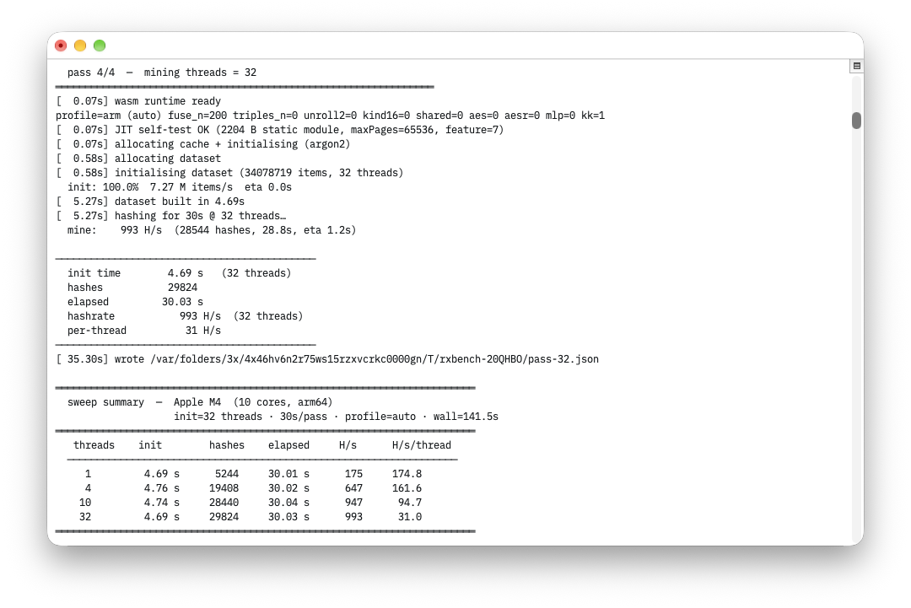
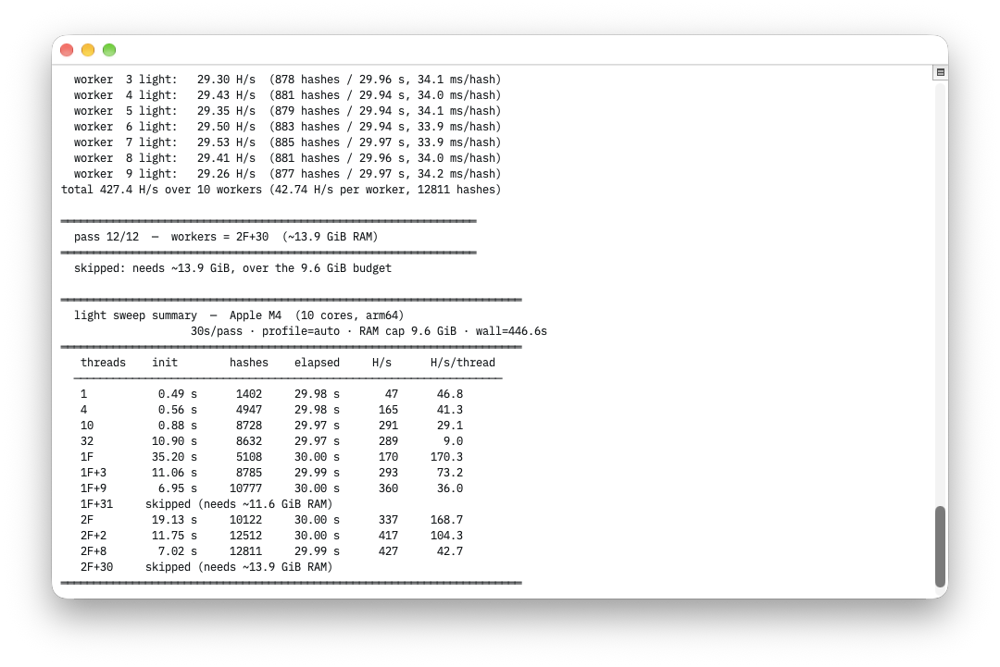
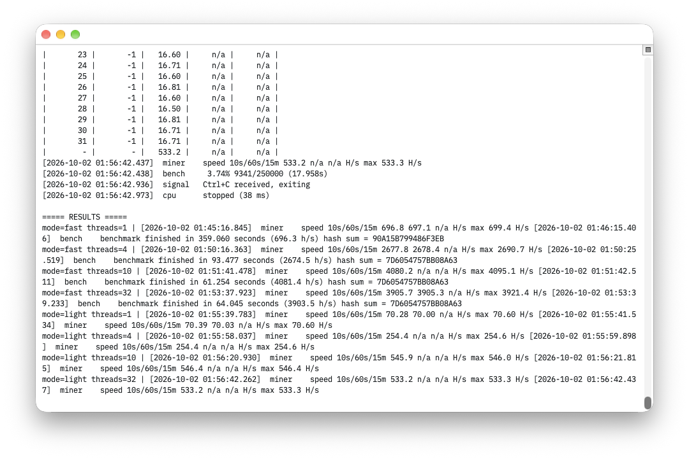

# RandomX bonanza

In-browser Monero (RandomX) miner achieving up to ~24% of native execution efficiency, packaged with an easy to set up demo environment. The raw miner payload is sub 500 KB. Shoutout to [Opus 4.7](https://www.anthropic.com/news/claude-opus-4-7), [Opus 5.5](https://www.anthropic.com/news/claude-opus-5-5) and [l1mey112's semifloat implementation](https://github.com/l1mey112/randomx.js).

## Requirements

- emcc (Emscripten SDK) ≥ 3.1
- clang
- binaryen (`wasm-opt`)
- node ≥ 18

```sh
brew install emscripten node binaryen llvm           # macOS
sudo apt install emscripten nodejs clang binaryen    # Debian/Ubuntu
sudo dnf install emscripten nodejs clang binaryen    # Fedora
sudo pacman -S  emscripten nodejs clang binaryen     # Arch
```

If your distro's `emscripten` is too old, install the upstream SDK instead:

```sh
git clone https://github.com/emscripten-core/emsdk
cd emsdk && ./emsdk install latest && ./emsdk activate latest
source ./emsdk_env.sh
```

Toolchain check (`ws` is vendored under `vendor/`, no `npm install`):

```sh
make install
```

## Build & run

```sh
make build       # → public/randomx{,_st}.{js,wasm}
make serve       # build + start the proxy on http://localhost:8080
make test        # canonical RandomX hash vs. reference test vector
make embed       # build + package the jsDelivr embed into dist/
make test-embed  # embed lifecycle and consent tests
make bench       # full-mode hashrate sweep (see Bench)
make bench-light # light-mode hashrate sweep (see Bench)
make clean       # remove build outputs
make fclean      # clean + drop .make/ stamps
make re          # fclean + build
```

## Browser support

> [!WARNING]
> Firefox is mostly untested.

- **Chromium / Firefox** — work out of the box over plain HTTP on localhost, since browsers treat `localhost` as a secure context (the proxy still sends the COOP/COEP headers SharedArrayBuffer / wasm pthreads need). Served without those headers, the miner falls back to single-thread light-mode workers (see `?sab=0`).
- **Safari** — refuses `SharedArrayBuffer` outside HTTPS even on localhost, so the local demo won't run there as shipped. Put an HTTPS proxy in front (e.g. `caddy reverse-proxy --to :8080`) and Safari works fine — the live preview at <https://randomx.cc/> runs without issues.

## Bench

```sh
make bench                           # regfile micro-bench + sweep 1,4,10,32 threads @ 30 s/pass
make bench DURATION=10               # shorter pass
make bench SWEEP=1,8,16,32           # custom thread set
make bench INIT_THREADS=16           # dataset init parallelism (1–32)
make bench SWEEP=32 DURATION=60      # single 32-thread, 60 s pass
make bench PROFILE=arm               # JIT generator profile: auto | arm | x86
make bench-light                     # light-mode sweep (no SharedArrayBuffer), fixed passes
```

## Efficiency

Apple M4 base · 10 cores · `make bench` (30 s/pass) vs. native `xmrig --bench=250K` (fast mode) at the same thread count. The xmrig numbers come from xmrig's `master` branch, chosen deliberately over the better performing `dev`, to make the number look more interesting.

| threads | init | WASM H/s | xmrig H/s | efficiency |
|--:|--:|--:|--:|--:|
| 1 | 4.69 s | 175 | 696\* | 25.1 % |
| 4 | 4.76 s | 647 | 2673\* | 24.2 % |
| 10 | 4.74 s | 947 | 4081\* | 23.2 % |
| 32 | 4.69 s | 993 | 3904\* | 25.4 % |

<sub>\* credit where it's due, the dev branch of xmrig performs at least 10% better than the numbers listed</sub>

In the browser on the same machine (32 threads): Chrome ~850–880 H/s, Safari ~800 H/s, Firefox ~700 H/s.

Light mode, `make bench-light` vs. `xmrig --bench=250K --randomx-mode=light` (xmrig threads share one cache; the light workers each build their own):

| threads | init | WASM H/s | xmrig H/s | efficiency |
|--:|--:|--:|--:|--:|
| 1 | 0.49 s | 47 | 70 | 66.6 % |
| 4 | 0.56 s | 165 | 254 | 64.9 % |
| 10 | 0.88 s | 291 | 546 | 53.3 % |
| 32 | 10.90 s | 289 | 533 | 54.2 % |

With full-dataset workers (`NF+M` = N full-dataset + M light workers):

> [!NOTE]
> This approach is relevant since it doesn't require SharedArrayBuffer.

| workers | init | WASM H/s | RAM (est.) |
|:--|--:|--:|--:|
| 1F | 35.20 s | 170 | ~2.5 GiB |
| 1F+3 | 11.06 s | 293 | ~3.4 GiB |
| 1F+9 | 6.95 s | 360 | ~5.2 GiB |
| 2F | 19.13 s | 337 | ~5.1 GiB |
| 2F+2 | 11.75 s | 417 | ~5.7 GiB |
| 2F+8 | 7.02 s | 427 | ~7.4 GiB |





## Payload

Demo page: **433 KB** per load.

```
index.html       33.2 KB     ui shell
miner.js         41.9 KB     ws client + ui control
worker.js        37.6 KB     wasm engine driver
randomx.js       57.8 KB     emscripten glue
randomx.wasm    262.9 KB     randomx engine + JIT + supjit kernel
```

Embed: **428 KB** in full mode, **396 KB** in light mode.

```
embed.js            68.6 KB     loader + widget + API
embed-worker.js      1.1 KB     full-mode thread broker
worker.js           37.6 KB     wasm engine driver
randomx.js          57.8 KB     emscripten glue (full)
randomx.wasm       262.9 KB     randomx engine (full)
randomx_st.js       42.1 KB     emscripten glue (light)
randomx_st.wasm    247.9 KB     randomx engine (light)
fb_full.js          11.8 KB     full-dataset replicas (light, only when replicas are on)
```

## Configuration

See the [Documentation of the elegant control plane of our embed script](docs/embed_sloppa.md).

## Layout

```
Makefile            install / build / serve / bench / test / embed / clean
config.js           wallet + pool + port defaults
proxy/index.js      HTTP + WS + raw-TCP stratum bridge
public/             browser assets (miner.js, worker.js, embed.js, built randomx{,_st}.{js,wasm})
dist/               jsDelivr/npm-ready embed distribution
scripts/            package-embed.mjs
tests/              embed tests
bench/              bench_webui.mjs · bench_sweep.mjs · bench_regfile.mjs · canonical_hash.mjs · …
docs/               embed script documentation
readme/             README images
wasm/               vendored RandomX C/C++ sources + build.sh
vendor/ws/          vendored npm ws (no npm install required)
```
